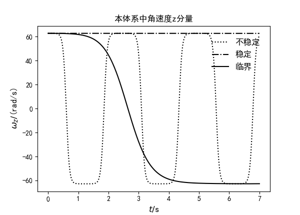
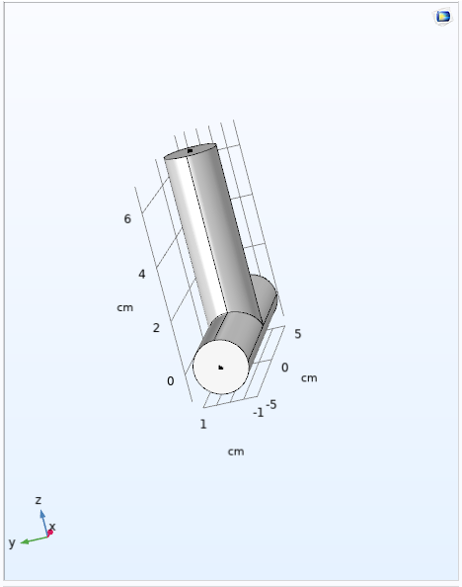
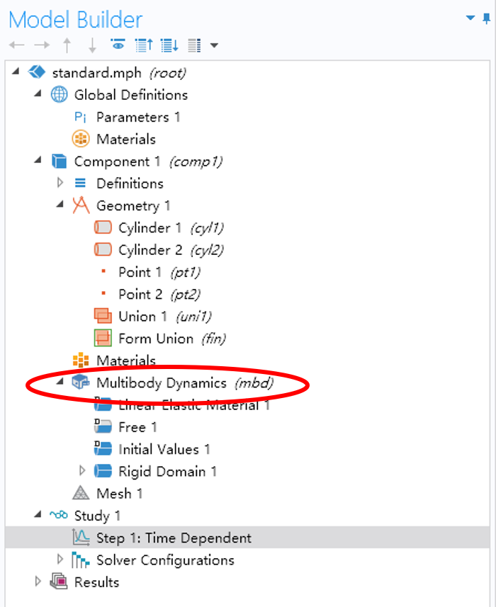
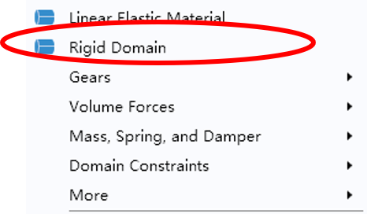
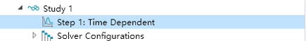
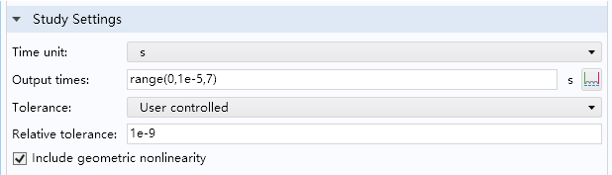
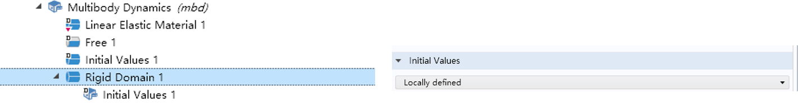
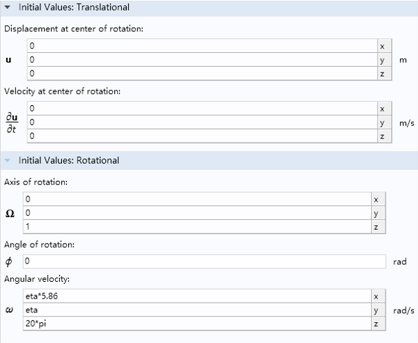

# Tennis Racket Effect
Ruiqi Feng[^1], Cuiqin Bai

## Introduction
TRE is the phenomenon where a rigid body's *unstable* rotation around its second inertial axis. The dynamics equation of a free rigid body is

<!-- $\begin{matrix}&{\dot{\mathrm{\Omega}}}_x=\frac{I_{yy}-I_{zz}}{I_{xx}}\mathrm{\Omega}_y\mathrm{\Omega}_z\\&{\dot{\mathrm{\Omega}}}_y=\frac{I_{zz}-I_{xx}}{I_{yy}}\mathrm{\Omega}_z\mathrm{\Omega}_x\\&{\dot{\mathrm{\Omega}}}_z=\frac{I_{xx}-I_{yy}}{I_{zz}}\mathrm{\Omega}_x\mathrm{\Omega}_y\\\end{matrix}$ -->  

When<!-- $I_{zz}$ --> takes an intermediate value and<!-- $\Omega_{0z}\gg \Omega_{0x}, \Omega_{0y}$ --> , the rigid body can be observed to flip while to rotate about the z-axis. A typical image of the angular velocity in the z axis when the TRE does or does not happen is shown as below:

## Numerical Simulation using COMSOL
Essentially the free rotation of a rigid body can be described using a system of 3 ODEs as is shown above. There are mature numerical methods which are not hard to implement. But we are using COMSOL anyways. The version of COMSOL used in this tutorial is 5.6.

#### Physics Field Setting
- Open COMSOL to create a new project. Select `Model Wizard` and then `3D` since we are interested in the object's 3-dimensional motion.
- Select `Multibody Dynamics` as the physics field. Choose `Time Dependent` for `Study`.

#### Rigid Body Setting
- Include the geometric bodies you want in `Component 1/Geometry`. We will take the T-shaped wrench as an example.
  - Add to cylinders and set their sizes.
- Choose `Form Union` in `Component 1/Geometry` and press `Build All` to form multiple geometric bodies into one.
  - Check how they look in the window on the right.
  - 
- Select the material. Since it is a rigid body, it is only the density that matters. Moreover, if the density distribution is homogeneous, even the density will not have any effect on the motion.

#### Simulation Settings
- Under `Component 1/Multibody Dynamics`, add `Rigid Domain` and add the geometric body we just created into this domain.
  - Click on `Multibody Dynamics`
   

  - Add `Rigid Domain` in the right-click menu 
   
   
- Choose `Study 1/Step 1: Time Dependent` and set the simulation step size and simulation duration. We are trivially solving an ODE so no mesh grid is required.
  - Select in the menu on the left
   

  - Adjust in the setting
   
   
- Set initial conditions in `Multibody Dynamics`. We need to ensure the the angular momentum along the second inertia axis is far greater then the other axes.
  - Set `Initial Values` to `Locally Defined` in `Rigid Domain`
  

  - Set the initial conditions in the submenu
  
- Start simulation and examine the results in `Results`. You can export the data for further analysis.

## Experiment using Phyphox
- Download `Phyphox` App on your smartphone
- Select to record the angular velocity
- Throw your smartphone in the air, trying your best to make it rotate around its second inertia axis.
- *Catch your phone to prevent extra expenses in case it is damaged.*
- Export the data and analyze it.

## Additional Materials

- My data analysis data can be found on [github](https://github.com/weenming/TRE_simulation)
- The COMSOL project I created can be also found on [github](https://github.com/weenming/TRE_simulation/tree/master/COMSOL)
- Another nice demo of TRE simulation can be found in [示例](https://www.comsol.com/blogs/why-do-tennis-rackets-tumble-the-dzhanibekov-effect-explained/), to which our project refers.

[^1]: Please contact me if you would like to leave comments or spotted mistakes here. Email: rqfeng20@fudan.edu.cn
